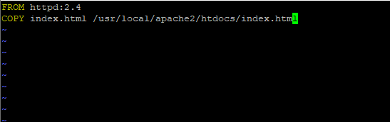

# Budowa własnego obrazu serwera www

Utworzysz własny obraz Docker będący serwerem www, zawierający twoją wersję pliku index.html

1. Utwórz plik Dockerfile
```
cd ~/docker-training/Lab\ 10/ 
sudo vi Dockerfile
```
```
FROM httpd:2.4
COPY index.html /usr/local/apache2/htdocs/index.html
```


2. Utwórz plik index.html
```
sudo vi index.html
```

```
<html>
<head>
  <title>Docker Workshop</title>
</head>
<body>
  <h1>Docker Workshop</h1>
    <h3>Lab 10</h3>
    <p>Budowa własnego obrazu serwera www</p>
  
</body>
</html>
```


3. Zbuduj obraz
```
sudo docker build -t my-web:latest .
```


4. Wyświetl listę obrazów i sprawdź czy istnieje twój obraz
```
sudo docker images
```


6. Uruchom kontener korzystając z własnego obrazu
```
sudo docker run -dit --name web2 -p 8082:80 my-web:latest
```


7. Sprawdź czy kontener działa
```
sudo docker ps -a --filter "name=web2"
```


8. Sprawdź jak wyświetli się strona www w przeglądarce: http://<IP_SERVERA>:8082

9. Wyświetl plik index.html wewnątrz kontenera
```
sudo docker exec web2 cat /usr/local/apache2/htdocs/index.html 
```

