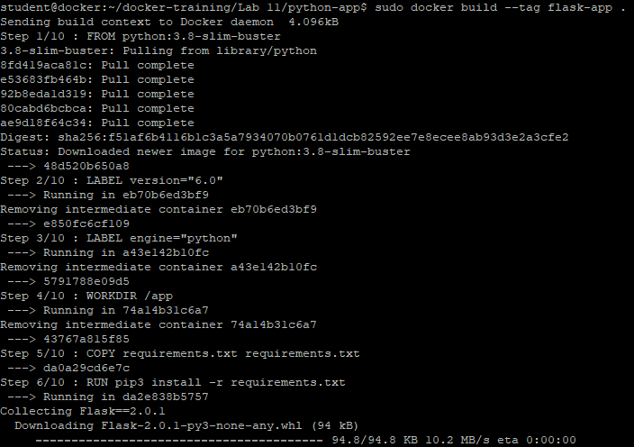
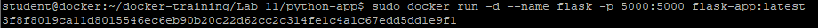
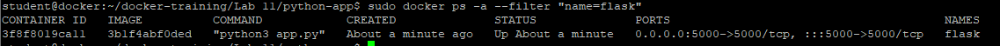
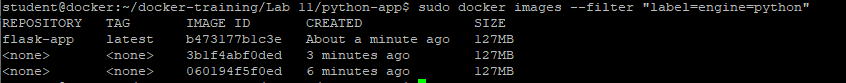

# Budowa obrazu aplikacji Python
Ćwiczenie pokaże w jaki sposób zbudować własną aplikację Python z modułem Flask

1. Przejdź do katalogu python-app i obejrzyj pliki
- Aplikacja Python: app.py
- Plik requirements.txt
- Dockerfile
```
cd ~/docker-training/Lab\ 11/python-app
```

2. Zbuduj obraz
```
sudo docker build --no-cache=true --tag flask-app .
```


3. Uruchom aplikację Flask
```
sudo docker run -d --name flask -p 5000:5000 flask-app:latest
```

4. Pokaż stronę
```
curl localhost:5000
```


5. Poszukaj kontenera flask na podstawie nazwy
```
sudo docker ps -a --filter "name=flask"
```


6. Poszukaj kontenera flask na podstawie LABEL ustawionej w pliku Dockerfile
```
sudo docker ps -a --filter "label=engine=python"
```


7. Poszukaj obrazu flask-app na podstawie LABEL ustawionej w pliku Dockerfile
```
sudo docker images --filter "label=engine=python"
```


8. Usuń kontener flask
```
sudo docker rm -f flask-app
```

