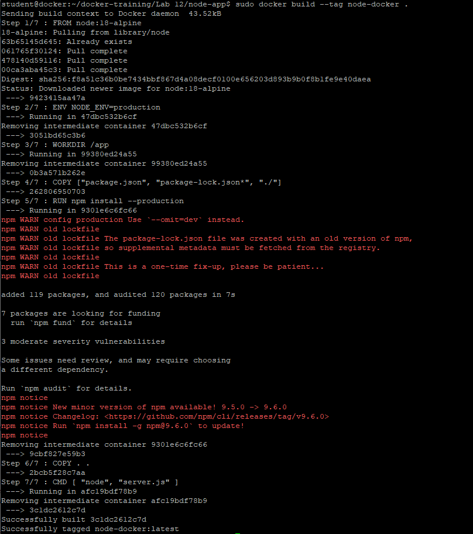

# Budowa obrazu aplikacji Node.js
Ćwiczenie pokaże w jaki sposób zbudować własną aplikację w Nodejs

1. Utwórz aplikację lokalnie
```
cd ~/docker-training/Lab\ 12/
sudo mkdir node-app
cd node-app
sudo npm init -y
sudo npm install ronin-server ronin-mocks
sudo vi server.js
```
Aplikacja server.js
```
const ronin = require('ronin-server')
const mocks = require('ronin-mocks')

const server = ronin.server()

server.use('/', mocks.server(server.Router(), false, true))
server.start()
```


2. Utwórz plik Dockerfile
```
sudo vi Dockerfile
```
```
FROM node:18-alpine
ENV NODE_ENV=production

WORKDIR /app

COPY ["package.json", "package-lock.json*", "./"]

RUN npm install --production

COPY . .

CMD [ "node", "server.js" ]
```


3. Utwórz plik ".dockerignore", w którym wpiszemy jakie katalogu mają być pomijane w trakcie budowania
```
sudo vi .dockerignore
```
```
node_modules
```

4. Zbuduj aplikację node-docker
```
sudo docker build --tag node-docker .
```


5. Uruchom kontener z aplikacją node-app na porcie 8086
```
sudo docker run -d --name node-app --publish 8086:8000 node-docker:latest
```

9. Sprawdź czy aplikacja działa
```
curl --request POST \
  --url http://localhost:8086/test \
  --header 'content-type: application/json' \
  --data '{"msg": "testing"}'
```
{"code":"success","payload":[{"msg":"testing","id":"dc0e2c2b-793d-433c-8645-b3a553ea26de","createDate":"2020-09-01T17:36:09.897Z"}]}


