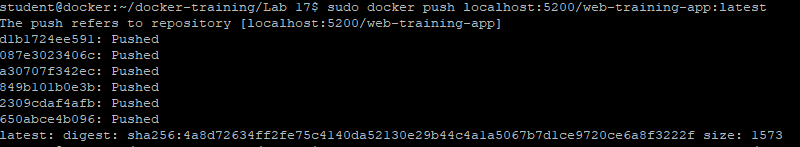
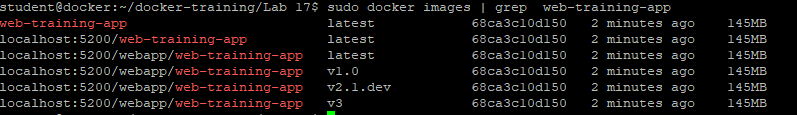

# Wysłanie własnego obrazu do Docker Registry
Ćwiczenie pokazuej w jaki sposób przygotować własny obraz z istniejącego kontenera, następnie go odpowiednio oznaczyć (tagging) dla Docker Registry a następnie wysłać do niego obraz.

1. Uruchom kontener httpd pod nazwą "web" i podmień w nim plik index.html na plik w katalogu web
```
cd ~/docker-training/Lab\ 17
sudo docker run -dit --name web -p 8087:80 httpd:2.4
sudo docker cp web/index.html web:/usr/local/apache2/htdocs/index.html
```

2. Z działającego kontenera utwórz nowy obraz dla aplikacji 'web-training-app'
Do tego potrzebny będzie ID kontenera, który uzyskasz wyświetlając działajace kontenery

```
sudo docker ps
sudo docker commit c3f279d17e0a  web-training-app:latest
```


3. Wyszukaj na liście obrazów obrazu web-training-app:latest
```
sudo docker images | grep web-training-app
```


4. Utwórz wersje obrazu dla lokalnego repozytorium i pokaż na liście obrazów
```
sudo docker tag web-training-app localhost:5200/web-training-app:latest
sudo docker images | grep web-training-app
```


5. Wyślij obraz do Docker Registry
```
sudo docker push localhost:5200/web-training-app:latest
```


6. Utwórz kilka nowych wersji obrazu do katalogu 'webapp' na Docker Registry
```
sudo docker image tag web-training-app localhost:5200/webapp/web-training-app:latest
sudo docker image tag web-training-app localhost:5200/webapp/web-training-app:v1.0
sudo docker image tag web-training-app localhost:5200/webapp/web-training-app:v2.1.dev
sudo docker image tag web-training-app localhost:5200/webapp/web-training-app:v3
```

7. Wyświetl listę obrazów w Docker
```
sudo docker images | grep web-training-app
```


8. Wyślij obraz do Docker Registry
```
sudo docker push --all-tags localhost:5200/webapp/web-training-app
```

