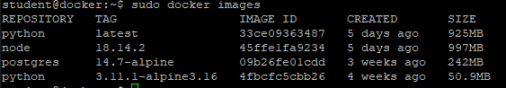
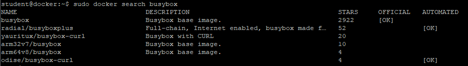
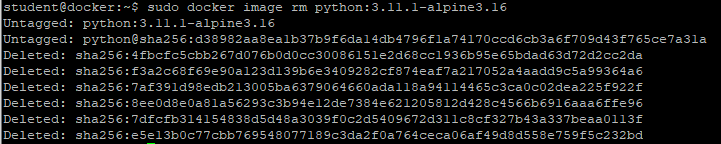
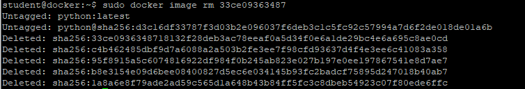

# Praca z obrazami kontenerowymi

1. Wejdź na stronę https://hub.docker.com/ i znajdź następujące obrazy
- python w ostatniej wersji
- python w wersji 3.11.1 opartej o Linux alpine 3.17
- nodejs w wersji 18.14.2
- postgres w wersji 14.7 na Linux Alpine

Zanotuj jakie są rozmiary dla OS linux/amd64

2. Pobierz wszystkie powyższe obrazy używając poleceń na Docker Hub lub tych poniżej
 ```
 sudo docker pull python
 ```
 ```
 sudo docker pull python:3.11.1-alpine3.17
 ```
 ```
 sudo docker pull node:18.14.2
 ```
 ```
 sudo docker pull postgres:14.7-alpine
 ```

3. Wyświetl wszystkie pobrane obrazy
```
sudo docker images
```
```
sudo docker image ls
```


4. Porównaj wielkość obrazów między wielkością z Docker Hub i wielkością w Docker

5. Znajdź obraz Busybox z poziomu Docker
```
sudo docker search busybox
```


6. Usuń obraz python:3.11.1-alpine3.16
```
sudo docker image rm python:3.11.1-alpine3.16
```


7. Usuń obraz postgress na podstawie jego ID
```
sudo docker image rm -f <ID>
```



8. Wyświetl manifest obrazu node:18.14.2
```
sudo docker manifest inspect node:18.14.2
```
