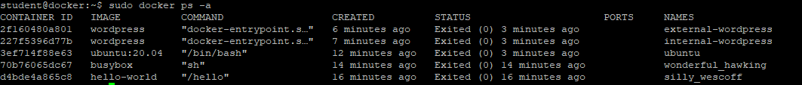
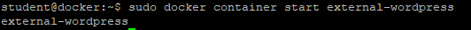
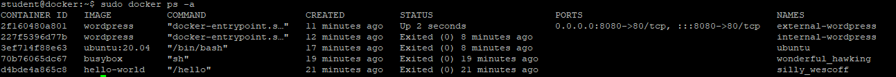

# Zarządzanie kontenerami

- zarządzanie uruchomionymi kontenerami tj start, stop, restart
- usuwaniem kontenerów
- wyświetlaniem logów kontenera
- update parametrów kontenera

Lab 4 jest kontynuuacją Lab3 !!!

1. Wyświetl wszystkie kontenery
Porównaj status kontenerów ze statusem z ćwiczenia Lab3 pkt 11

```
sudo docker ps -a
```


2. Uruchom kontener o nazwie external-wordpress i sprawdź jego status na liście kontenerów
```
sudo docker container start external-wordpress
```


3. Wyświetl ponownie wszystkie kontenery i sprawdź status kontenera external-wordpress
```
sudo docker ps -a
```


4. Zrestartuj kontener o nazwie external-wordpress
```
sudo docker container restart external-wordpress
```


5. Wyświetl ponownie wszystkie kontenery i sprawdź status kontenera external-wordpress
```
sudo docker ps -a
```


6. Zatrzymaj kontener o nazwie external-wordpress i sprawdź jego status na liście kontenerów
```
sudo docker container stop external-wordpress
```


7. Usuń kontener external-wordpress i sprawdź czy nadal jest na liście kontenerów
```
sudo docker rm -f external-wordpress
```


8. Zaktualizuje parametr uruchomionego kontenera internal-wordpress
Istnieje możliwość zmiany parametrów zgodnie z listę na stronie https://docs.docker.com/engine/reference/commandline/update/
```
sudo docker update --memory 256M internal-wordpress
sudo docker update --restart always internal-wordpress
```

9. Wyświetl logi kontenera internal-wordpress
```
sudo docker logs internal-wordpress
```
```
sudo docker logs internal-wordpress --tail 2
```


10. Wyświetl eventy dla kontenera internal-wordpress
```
sudo docker events --filter 'container=internal-wordpress'
```


