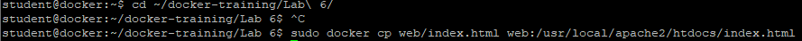
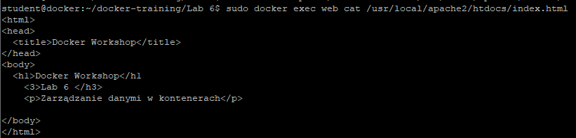
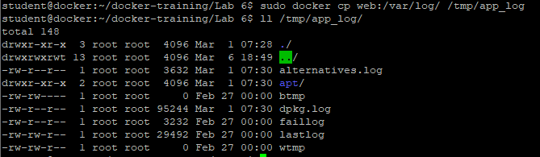

# Zarządzanie danymi w kontenerach

1. Uruchom kontener httpd
```
sudo docker run -dit --name web -p 8081:80 httpd:2.4
```


2. Wyświetl stronę www w przeglądarce
```
http://<IP>:8081
```

3. Wyświetl index.html z kontenera 'web'
```
sudo docker exec -it web /bin/bash

# cat /usr/local/apache2/htdocs/index.html
```
lub
```
sudo docker exec web cat /usr/local/apache2/htdocs/index.html
```


4. Zmień plik index.html w kontenerze. Plik index.html znajduje się w katalogu web
```
cd ~/docker-training/Lab\ 6/
sudo docker cp web/index.html web:/usr/local/apache2/htdocs/index.html
```
Sprawdź w przeglądarce obecną treść strony



5. Pobierz logi lub inne pliku z kontenera na maszynę wirtualną
```
sudo docker cp web:/var/log/ /tmp/app_log
sudo ll /tmp/app_log
```

