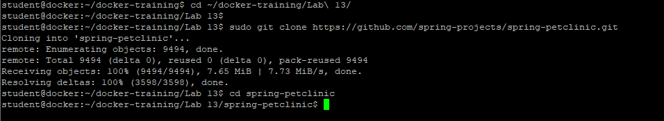
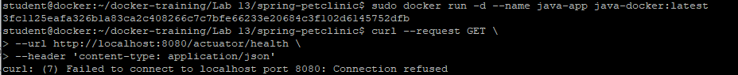
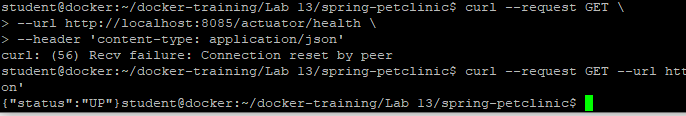

# Budowa obrazu aplikacji JAVA
Ćwiczenie pokaże w jaki sposób zbudować własną aplikację JAVA Spring

1. Pobierz kod aplikacji
```
cd ~/docker-training/Lab\ 13/
sudo git clone https://github.com/spring-projects/spring-petclinic.git
cd spring-petclinic
```


2. Utwórz plik Dockerfile
```
FROM eclipse-temurin:17-jdk-jammy

WORKDIR /app

COPY .mvn/ .mvn
COPY mvnw pom.xml ./
RUN ./mvnw dependency:resolve

COPY src ./src

CMD ["./mvnw", "spring-boot:run"]
```

3. Utwórz plik ".dockerignore", w którym wpiszemy jakie katalogu mają być pomijane w trakcie budowania
```
target
```

4. Zbuduj aplikację java-docker
```
sudo docker build -t java-docker .
```

5. Uruchom kontener z aplikacją java-docker
```
sudo docker run -d --name java-app java-docker:latest
```

6. Sprawdź czy aplikacja działa
```
curl --request GET \
--url http://localhost:8080/actuator/health \
--header 'content-type: application/json'
```
curl: (7) Failed to connect to localhost port 8080: Connection refused


7. Zatrzymaj kontener "java-app"
```
sudo docker container stop java-app
```

8. Uruchom ponownie kontener z aplikacją java-docker na porcie 8085
```
sudo docker run -d --name java-app-2 --publish 8085:8080 java-docker:latest
```

9. Sprawdź ponownie czy aplikacja działa. Jeśli nie działa, odczekaj chwilę i sprawdź jeszcze raz. Aplikacja Java w kontenere musi się uruchomic. Zawsze można zajrzeć do logów kontenera
```
curl --request GET \
--url http://localhost:8085/actuator/health \
--header 'content-type: application/json'
```

