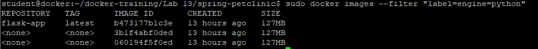
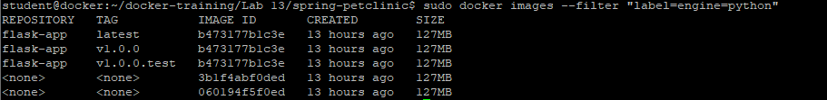

# Wersjonowanie aplikacji - Tagowanie
Ćwiczenie pokaże w jaki sposób można wersjonować aplikację.

1. Wyświetl obrazy aplikacji python z Lab 11
```
sudo docker images --filter "label=engine=python"
```


2.Utwórz wersję aplikacji v1.0.0
```
sudo docker tag flask-app:latest flask-app:v1.0.0
```

3.Utwórz wersję aplikacji v1.0.0.test
```
sudo docker tag flask-app:latest flask-app:v1.0.0.test
```

4. Wyświetl ponownie obrazy aplikacji flask 
```
sudo docker images --filter "label=engine=python"
```



