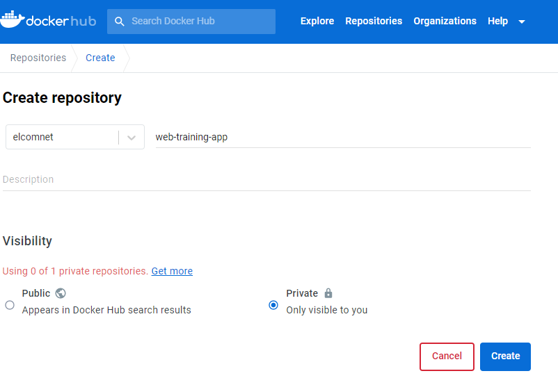
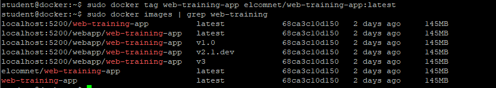
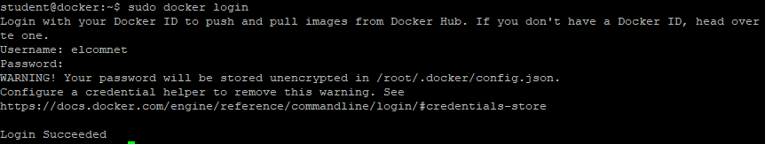
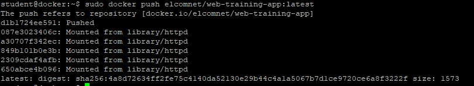
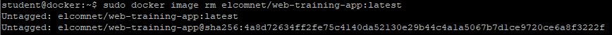
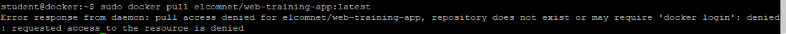

# Export obrazu na Docker Hub
Ćwiczenie pokaże w jaki sposób utworzyć i wysłać obraz do prywatnego repozytorium na Docker Hub.
Do jego wykonania będzie potrzebne prywatne konto na Docker Hub

1. Zaloguj się na https://hub.docker.com/ i załóż Prywatne repozytorium
- Wejdź na https://hub.docker.com i zaloguj się na swoje konto
- W górnym menu przejdź do Repositories
- Kliknij 'Create repository'
- Wpisz w polu 'Name': web-training-app
- Wybierz 'Visibility': Private
- Kliknij 'Create'



2. Utwórz wersje obrazu dla DockerHub
```
sudo docker tag web-training-app <user_name_docker_hub>/web-training-app:latest
```


3. Zaloguj się do Docker Hub
```
sudo docker login
```


4. Wyślij obraz do prwatnego repozytorium na Docker Hub
```
sudo docker push <user_name_docker_hub>/web-training-app:latest
```


5. Sprawdź na Docker Hub czy jest obraz web-training-app:latest

6. Wyloguj z Docker Hub
```
sudo docker logout
```

7. Usuń obraz z lokalnego repo
```
sudo docker image rm <user_name_docker_hub>/web-training-app:latest
```


8. Spróbuj pobrać obraz z Prywatnego repozytorium
```
sudo docker pull <user_name_docker_hub>/web-training-app:latest
```

