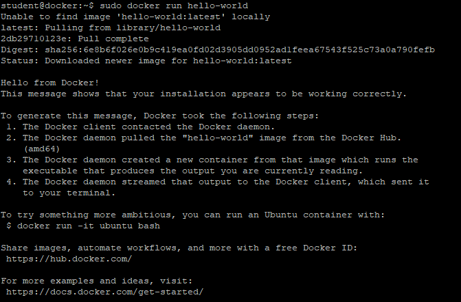
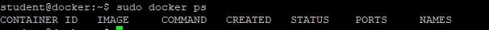
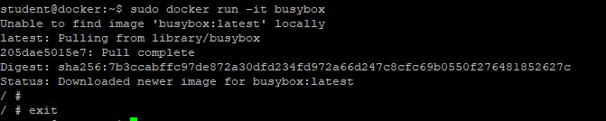
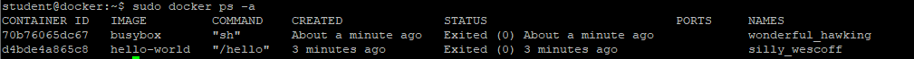
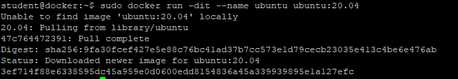
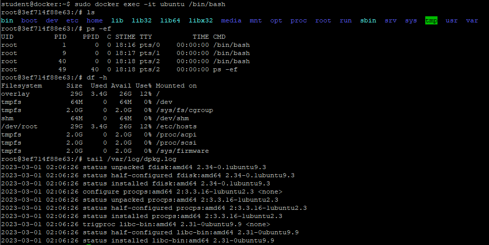
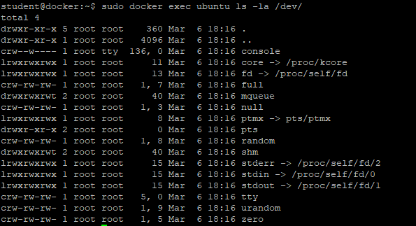
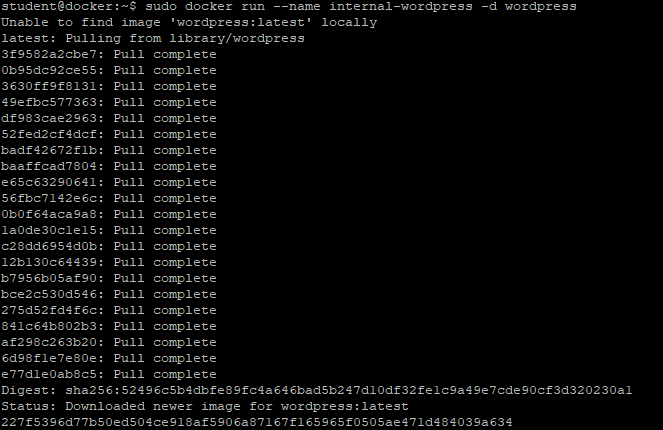
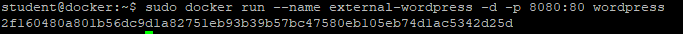
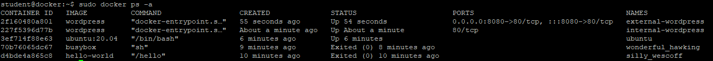

# Uruchamianie kontenerów

1. Pierwszy kontener
```
sudo docker run hello-world
```


2. Wyświetl listę działających kontenerów. Czy kontener hello-world jest na liscie? Jaką ma nazwę?
```
sudo docker ps
```


3.  Drugi kontener
```
sudo docker run -it busybox
```
Wyjdź z kontenera wpisując 'exit'


4. Wyświetl listę działających kontenerów. Czy kontener busybox jest na liscie? Jaką ma nazwę?
```
sudo docker ps
```

5. Wyświetl wszystkie kontenery 
```
sudo docker ps -a
```


6. Trzeci kontener
```
sudo docker run -dit --name ubuntu ubuntu:20.04
```


7. Wejdź do kontenera
```
sudo docker exec -it ubuntu /bin/bash
```
Wykonaj kilka poleceń Linuxowych:
- ls
- ps -ef
- df -h
- tail /var/log/dpkg.log
Na końcu wyjdź z kontenera poleceniem 'exit'


8. Uruchom poleceń "ls -la " w kontenerze bez wchodzenia do niego
```
sudo docker exec ubuntu ls -la /dev
```


9. Czwarty kontener
```
sudo docker run --name internal-wordpress -d wordpress
```


10. Piąty kontener - wystaw na świat :)
Zauważ, że nie w tym przypadku obraz wordpress nie został pobrany
```
sudo docker run --name external-wordpress -d -p 8080:80 wordpress
```


11. Wyświetl wszystkie kontenery 
Zwróć uwagę na nazwy kontenerów, porty, status.
Zrób zrzut ekranu stanu kontenerów
```
sudo docker ps -a
```


12. Zrestartuj maszynę wirtualną
```
sudo reboot
```
