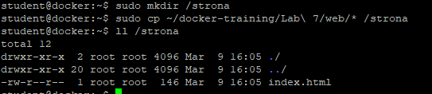
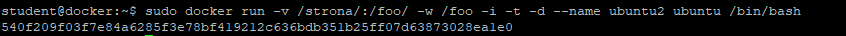
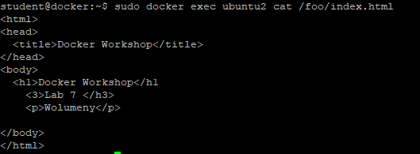
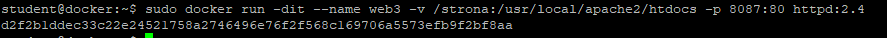
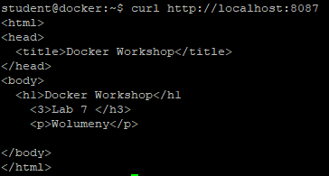
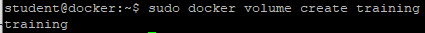
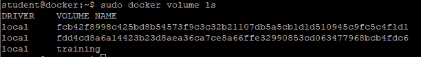
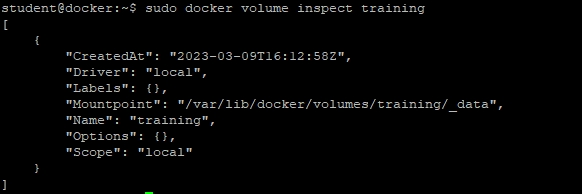
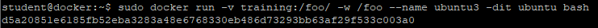
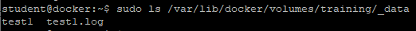

# Wolumeny
Ćwiczenie pokaże w jaki sposób zamontować do kontenera zewnętrzny katalog lub wolumen

1. Utwórz katalog z zawartością strony www
```
sudo mkdir /strona
sudo cp -rf ~/docker-training/Lab\ 7/web/index.html /strona
ll /strona
```


2. Zamontuj katalog /strona do kontenera ubuntu
```
sudo docker run -v /strona/:/foo/ -w /foo -i -t -d --name ubuntu2 ubuntu /bin/bash
```


3. Sprawdź czy w kontenerze widać plik index.html
```
sudo docker exec ubuntu2 cat /foo/index.html
```


4. Uruchom kontener httpd z zamontowaną zewnętrznym katalogiem zawierającym plik index.html
```
sudo docker run -dit --name web3 -v /strona:/usr/local/apache2/htdocs -p 8087:80 httpd:2.4
```


5. Wyświetl stronę w przeglądarce lub wykonaj curl
```
curl http://localhost:8087
```


6. Utwórz wolumen o nazwie training
```
sudo docker volume create training
```


7. Wyświetl listę wolumenów
```
sudo docker volume ls
```


8. Wyświetl właściwości wolumenu "training" a szczególnie znajdź punkt montowania
```
sudo docker volume inspect training
```


7. Zamontuj wolumen do kontenera ubuntu
```
sudo docker run -v training:/foo/ -w /foo --name ubuntu3 -dit ubuntu bash
```


8. Utwórz plik "test1" w konterze "foo" i sprawdź czy plik znajduje się w kontenerze
```
sudo docker exec ubuntu3 touch /foo/test1
sudo docker exec ubuntu3 ls /foo/
```

9. Sprawdź co widać w katalogu z punktem montowania
```
sudo ls /var/lib/docker/volumes/training/_data
```

