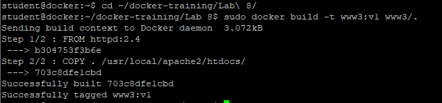
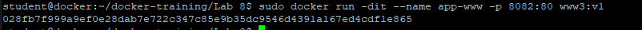
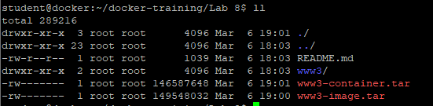
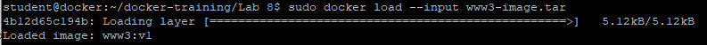

# Backup and Restore
W tym ćwiczeniu zostaną pokazane mechanizmy wykonywania kopi zapasowowej obrazów i kontenerów oraz ich przywracanie z plików do instancji Docker.

1. Zbuduj obraz www3 w oparciu o pliki z katalogu www3
```
cd ~/docker-training/Lab\ 8/
sudo docker build -t www3:v1 www3/.
```


2. Uruchom kontener app-www z obrazu www3:v1
```
sudo docker run -dit --name app-www -p 8082:80 www3:v1
```


3. Zapisz obraz do pliku
```
sudo docker save --output www3-image.tar www3:v1
```

4. Wykonaj export działającego kontenera app-www do pliku
```
sudo docker export --output="www3-container.tar" app-www
```

5. Wyświetl pliki w katalogu
```
ll
```


6. Usuń kontener
```
sudo docker rm -f app-www
```

7. Usuń obraz www3
```
sudo docker image rm -f www3:v1
```

8. Przywróć obraz www3:v1 z pliku
```
sudo docker load --input www3-image.tar
```


9. Wyświetl listę obrazów i sprawdź czy znajduje się na niej wczytany obraz
```
???
```

10. Importuj kontener z pliku
```
sudo docker import www3-container.tar
```

11. Wyświetl listę kontenerów i sprawdź czy znajduje się na niej zaimportowany kontener
```
???
```


