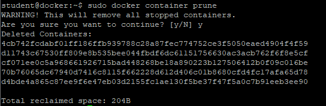
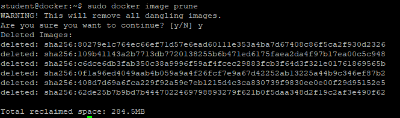
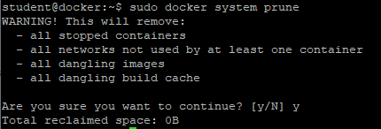
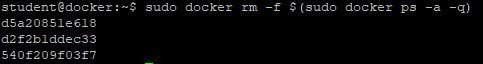
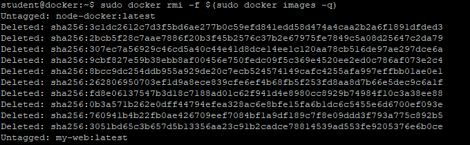

### Docker Clean up

Uruchamianie, zatrzymywanie, usuwanie kontenerów może pozostawiać "śmieci" w systemie w postaci nieużywanych obrazów, nieużywanych sieci, nieużywanych (zatrzymanych) kontenerów

Istnieje kilka metod na "czyszczenie" instancji Dockera

1. Zatrzymaj 2 istniejące kontenery
```
sudo docker container stop ubuntu3
```

2. Usuń zatrzymane kontenery
```
sudo docker container prune
```


3. Wyświetl listę obrazów
```
sudo docker images
```

4. Usuń niepotrzebne obrazy
```
sudo docker image prune
```


5. Usuń wszystkie niepotrzebne obiekty
```
sudo docker system prune
```


6. Usuń wszystkie kontenery
```
sudo docker rm -f $(sudo docker ps -a -q)
```


7. Usuń wszystkie obrazy
```
sudo docker rmi -f $(sudo docker images -q)
```

